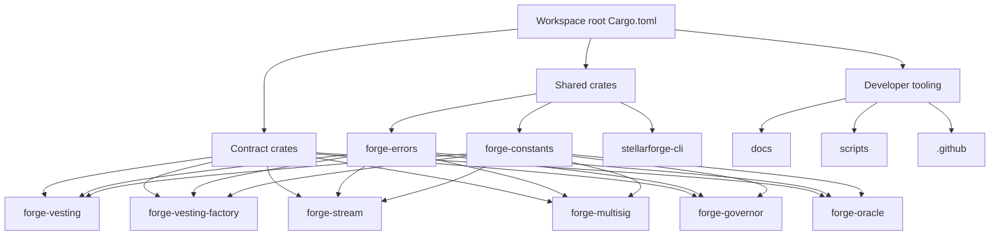
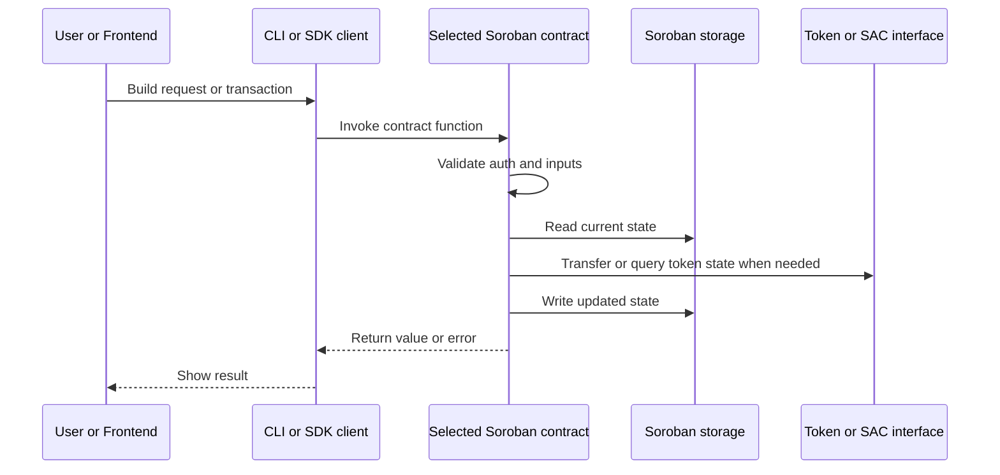

# Project Architecture

This document explains how StellarForge is organized, what each major module is responsible for, and how a typical contract call flows through the system.

---

## Architecture At A Glance

StellarForge is a Rust workspace for Soroban smart contracts. The repository is organized around three main ideas:

- independent contract crates in `contracts/`
- shared reusable code in `crates/`
- contributor and developer support material in `docs/`, `scripts/`, and `.github/`

Each contract is intentionally isolated so it can be built, tested, and deployed on its own. Shared behavior such as common errors and constants lives in workspace crates so contracts stay consistent without copying code.



---

## Repository Layout

```text
stellarforge/
|- .github/                  CI, templates, and repository automation
|- contracts/                Soroban smart contract crates
|- crates/                   Shared Rust crates and CLI tooling
|- docs/                     Contributor and integration documentation
|- scripts/                  Helper scripts for local workflows
|- Cargo.toml                Workspace manifest
|- Makefile                  Common build/test/lint shortcuts
|- README.md                 Main project overview
|- CONTRIBUTING.md           Contribution workflow and conventions
```

---

## Major Folders And Modules

### Workspace Root

The root `Cargo.toml` defines the Rust workspace and lists every member crate. This is the entry point for commands like:

- `cargo build --workspace`
- `cargo test --workspace`
- `cargo clippy --workspace -- -D warnings`

The root also centralizes shared dependencies such as `soroban-sdk`.

### `contracts/`

This folder contains the on-chain Soroban primitives. Each subfolder is its own deployable crate with:

- `Cargo.toml` for crate metadata and dependencies
- `src/lib.rs` for contract logic, storage types, errors, and tests
- `README.md` for contract-specific behavior and usage notes

Current contracts:

- `forge-vesting`: Single-beneficiary token vesting with cliff and linear release.
- `forge-vesting-factory`: One deployment that manages many independent vesting schedules.
- `forge-stream`: Real-time token streaming with withdrawal, pause, resume, and cancel flows.
- `forge-multisig`: Treasury-style N-of-M approvals with delayed execution.
- `forge-governor`: Token-weighted proposal and voting lifecycle.
- `forge-oracle`: Admin-managed price feed for protocols that need on-chain pricing data.

Important design note:

- The contracts are separate crates, not internal Rust modules of one application.
- They share code through workspace crates, but they are meant to be deployed independently.
- Composition usually happens at the application level, where a frontend, script, or protocol uses multiple contracts together.

### `crates/`

This folder contains reusable Rust crates that support multiple contracts.

- `forge-errors`: Shared error variants used across contracts so common failure cases stay consistent.
- `forge-constants`: Shared constants that help avoid repeated magic numbers and keep behavior aligned.
- `stellarforge-cli`: A lightweight command-line tool for listing, building, testing, and deploying StellarForge contracts.

These crates reduce duplication and make cross-contract behavior easier to understand for contributors and integrators.

### `docs/`

This folder contains project-level documentation for contributors and integrators. Examples in the current repository include code quality guidance, frontend integration notes, and screenshots/diagram references.

This new `architecture.md` file belongs here because it explains how the whole repository fits together.

### `scripts/`

This folder contains helper scripts for local development tasks such as seeding environments and updating generated artifacts.

Scripts are not part of contract runtime behavior, but they are part of the contributor workflow.

### `.github/`

This folder typically contains GitHub Actions workflows, issue templates, and pull request automation. Contributors usually touch it only when changing CI or repository process.

---

## How The Pieces Fit Together

### Shared Code Flow

At compile time, most contracts depend on the shared crates:

- `forge-errors` gives contracts a common error vocabulary.
- `forge-constants` provides shared numeric and configuration constants.
- `soroban-sdk` provides the Soroban contract runtime types and macros.

This means contributors can often make cross-cutting improvements in one shared crate instead of repeating the same change in every contract.

### Contract Boundaries

Each contract owns its own:

- storage layout
- public contract interface
- authorization checks
- tests
- README documentation

That separation is important for maintainability. If you are changing one primitive, you can usually work inside a single crate without needing to understand every other contract in detail.

### Composability

The contracts are designed to be combined by outside applications rather than tightly coupling to each other in the Rust codebase.

For example, an application could:

1. use `forge-governor` to approve an action
2. use `forge-multisig` to authorize treasury movement
3. use `forge-stream` or `forge-vesting` to distribute funds
4. use `forge-oracle` for price-aware protocol logic

That is a workflow-level integration pattern, not a direct Rust module dependency inside the workspace.

---

## High-Level Request Flow

The most common path through the system looks like this:



In plain terms:

1. A user, script, or frontend chooses a contract function to call.
2. The CLI or another client submits that invocation to Soroban.
3. The selected contract checks authorization and validates inputs.
4. The contract reads and updates ledger-backed storage.
5. If needed, it interacts with a token contract or Stellar Asset Contract interface.
6. The result is returned to the caller.

This same high-level pattern applies across vesting, streaming, governance, multisig, and oracle flows.

---

## Contributor Mental Model

If you are new to the repository, this is a good way to navigate it:

1. Start with `README.md` for project goals and contract summaries.
2. Open the specific crate you want to change in `contracts/` or `crates/`.
3. Read that crate's `README.md` before editing `src/lib.rs`.
4. Check `CONTRIBUTING.md` for testing, commit, and review expectations.
5. Run focused tests for the crate you touched, then run workspace checks if the change is broader.

Useful shortcuts:

- contract behavior change: start in `contracts/<name>/src/lib.rs`
- shared error or constant change: start in `crates/forge-errors` or `crates/forge-constants`
- tooling change: start in `crates/stellarforge-cli/src/main.rs`
- process or documentation change: start in `docs/`, `README.md`, or `CONTRIBUTING.md`

---

## Summary

StellarForge is a multi-crate Soroban workspace built around small, reusable contract primitives. The `contracts/` directory contains deployable on-chain units, `crates/` contains shared building blocks and tooling, and the rest of the repository supports contributor workflows. Most changes are easiest to reason about when you keep those boundaries in mind: shared code for consistency, isolated contracts for clarity, and composition at the application level.
